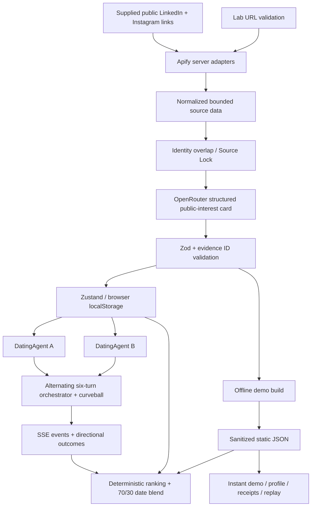

# THIRD WHEEL

**Let your agent take the awkward first date.** Two public social profiles become a grounded conversation card; application-level agents meet, and each ranks the room from its own perspective.

## Current release

The complete offline showcase contains **25 fictional characters, 60 precomputed dates, and 600 directional rankings**. Fictional evidence and outcomes are explicitly labeled in the interface. This is not a verified 25-real-person dataset, and the stock portraits do not establish anyone's identity. `seed/people.json` intentionally contains no invented real-person links.

Live profile reading is implemented behind server-only Apify adapters. Live dates alternate six independent DatingAgent turns and two reflections through OpenRouter. Without a model key, dates use an explicitly labeled fallback simulation. Local provider keys are configured and a real OpenRouter-generated household turn has been verified; the free model also produced fallback turns. Real-profile scraping remains unverified. Do not represent fallback dates as model-generated conversations or fictional receipts as scraped evidence.

## Run locally

Use Node.js 22 or newer:

```sh
npm ci
cp .env.example .env.local
npm run dev
```

Open http://localhost:3000. `/demo` needs no credentials and makes no paid API requests on page load. `/lab` supports your own adult participant's two public links. You can also add three clearly fictional agents to exercise Lab persistence, chosen-pair dates, and updated rankings without paying for scraping.

```sh
npm run typecheck
npm test
npm run build
npm start
```

## Screenshots and assessment

- Landing, profile analysis, Date Night, and rankings: capture from the running app.
- Website: add your deployed Vercel URL here.
- Video: add the finished recording URL here.
- Repository: https://github.com/adityaapraveen/Third-Wheel
- Recording guide: [VIDEO_SCRIPT.md](VIDEO_SCRIPT.md).

## Architecture



`src/app` owns routes, `src/components` owns presentation, `src/lib/scrapers` isolates vendor formats, `src/lib/persona` owns grounded analysis, `src/lib/agents` owns conversation state, `src/lib/matching` owns deterministic scores, and `src/store` owns local session persistence. No database is required.

## Environment

All credentials remain server-side. Never add a `NEXT_PUBLIC_` prefix to provider secrets.

- `APIFY_TOKEN`: required to read profiles. Set an account spending limit before public use.
- `OPENROUTER_API_KEY`: required for model-generated analysis and conversations.
- `OPENROUTER_MODEL`: defaults to `openrouter/free`. Availability depends on the provider.
- `NEXT_PUBLIC_APP_URL`: canonical deployment origin, or `http://localhost:3000` locally.
- `APIFY_LINKEDIN_ACTOR`: defaults to `datascraperes/linkedin-public-profile-scraper`.
- `APIFY_INSTAGRAM_ACTOR`: defaults to `apify/instagram-profile-scraper`.
- `LAB_ACCESS_CODE`: optional server-side access code for paid live endpoints.
- `DEMO_SEED_FILE`: optional path to a participant seed for the offline build.

## Scraping and evidence

LinkedIn accepts only HTTPS `linkedin.com/in/...` person URLs. Instagram accepts only HTTPS profile URLs; posts, reels, stories, userinfo, unusual ports, and lookalike domains are rejected before any actor call. The Instagram actor runs first so private or unconfirmed-public accounts are rejected before spending on LinkedIn. No paid Instagram extras, login, or cookies are requested by this application; actor availability and public access remain provider-dependent.

Actor fields are normalized immediately. Text lengths and post counts are bounded; at most 12 public captions are analyzed. The model sees headline, about, work descriptions, skills, biography, captions, and short source evidence. Follower counts do not determine personality or compatibility. Search may discover the official profile URLs but is never an analysis source.

Source Lock compares public name tokens, handles, professional bio overlap, and an explicit profile link. It is heuristic evidence, not identity or adult-age verification. A weak match requires manual confirmation in Lab. The offline builder rejects it to avoid silently publishing mismatched people.

Model inputs explicitly identify social content as untrusted data. Every signal must reference a supplied evidence ID. Zod validates structured JSON; malformed replies get one retry, then deterministic interest extraction. Sparse evidence keeps confidence low, unobserved traits stay neutral, and romantic needs and preferences are not inferred from someone else's social profiles. The profile visibly separates Needs, Hobbies, Interests, public signals, and evidence quality. A person can still choose their own low-pressure activity.

## Agents and Date Night

Each `DatingAgent` carries its persona, conversational memory, goal, and lifecycle state. `DateOrchestrator` chooses a stable curveball from the sorted pair IDs, calls A then B for six total messages, inserts the scenario halfway through, and requests a final directional reflection from each agent. Responses may use hypothetical interest-based plans; they must not invent autobiographical details.

`POST /api/date/live` streams `date_started`, `agent_thinking`, `agent_message`, `curveball`, `confessional`, `chemistry_update`, and `date_finished`. Public confessionals are short summaries, never hidden reasoning. The engagement meter is playful presentation. When any provider step falls back, the whole date is marked `fallback`. Cancelling stops subsequent orchestration work; already-issued provider calls may still finish and incur cost.

Offline compact mode batches up to eight pairs per model request for reliable, cheaper replay data. It is distinct from live multi-turn orchestration. Fixture mode is authored, not model-generated.

## Ranking algorithm

`scoreCandidate(viewer, candidate)` blends:

- 30% viewer preference alignment (neutral when unavailable).
- 20% public lifestyle rhythm.
- 15% conversation potential.
- 15% ambition pace.
- 10% shared interests.
- 10% complementary traits.

The viewer's preferences and the candidate's complementary qualities make scores directional. Fictional preference vectors are authored and labeled. Real profiles use neutral preferences rather than pretending to know romantic desires. Unknown neutral vectors may produce ties; deterministic ID ordering resolves ties, and tied scores should not be read as strong evidence of preference.

If the pair dated, the final score is 70% pre-date compatibility plus 30% **that viewer's** post-date outcome. Each person ranks every other candidate, excluding themselves. Only the latest date between a pair contributes. A mutual is a pair where both rank the other in their top five. Match score and evidence confidence are displayed separately; sparse data lowers certainty, not a person's value.

Rankings update immediately when Lab adds a person, without automatically buying dates against everyone. Full dates run only for the chosen pair.

## Build a real precomputed demo

Populate `seed/people.json` with at least 25 adult participants' supplied official public links, or point `DEMO_SEED_FILE` to your private seed:

```json
[
  {
    "id": "participant-1",
    "linkedinUrl": "https://www.linkedin.com/in/ACTUAL-PARTICIPANT/",
    "instagramUrl": "https://www.instagram.com/ACTUAL-PARTICIPANT/"
  }
]
```

These placeholders are illustrative; replace them with real links, and do not invent URLs. Obtain permission before publishing participant-derived material. Do not include manually authored traits in the seed.

```sh
npm run demo:build
```

The script loads `.env.local`, validates URL and ID uniqueness, reads two people at a time to bound provider concurrency, rejects private Instagram and weak Source Lock, generates evidence-backed cards, schedules five round-robin rounds, generates compact dates in batches of eight, ranks all other candidates, and atomically replaces `src/data/demo.generated.json` only after success. Each person has four or five dates for a 25-person schedule.

Ignored `artifacts/demo-cache` contains sanitized derived personas to resume an interrupted run; it never contains raw actor payloads. Delete the relevant cache file to refresh a profile. Failed builds preserve the published demo. Inspect resulting evidence and fallback labels before committing. `npm run demo:fixtures` explicitly restores the fictional cast and authored simulations.

## Privacy, security, and production tradeoffs

Only the two submitted public sources are used. No protected or sensitive traits, orientation, race, ethnicity, religion, politics, health, income, attractiveness, or relationship status are inferred or scored. Agent outcomes are fictional application behavior, not statements of a human's interest in another human. Photos are presentation, never ranking inputs.

Participant consent is confirmed before Lab requests. Session cards and dates persist in this browser until removed. This is localStorage, not encrypted storage; shared devices should clear the session. Provider requests transmit the supplied public data to Apify and OpenRouter. Credentials and raw provider payloads are never persisted in the browser or committed.

Live endpoints enforce origin checks, bounded JSON input, optional access code, and small per-IP in-memory limits. These limits reset across serverless instances and are not a distributed abuse defense. Use a protected Lab access code, provider spending limits, and deployment-level rate limiting before exposing costly APIs publicly. A database is deliberately omitted; multi-device accounts, centralized deletion, and durable distributed queues are outside this prototype.

## Deploy on Vercel

Import this repository as a Next.js project, use Node.js 22+, set the environment values on the server, and deploy with the default `npm run build` command. Static demo routes remain independent of paid credentials. API routes declare the Node runtime and request up to 300 seconds; confirm your Vercel plan supports the configured duration. The model client uses bounded timeouts and a single repair attempt. Scraping two sources and generating model output can still exceed shorter hosting limits.

After deployment, smoke-test `/demo`, a profile's Receipts, replay, rankings, and Lab. A passing local build confirms build compatibility, not live provider availability or successful deployment.

## Validation

The test suite covers public URL canonicalization and SSRF-style inputs, private/unknown Instagram rejection, caption limits, name mismatches, grounded demo evidence, unique schedule coverage, 24 candidates per person, directionality, outcome blending, mutuals, cancellation, six fallback turns, and malformed JSON recovery. Browser smoke testing exercises cast, profile, receipts, replay, Lab, and persistence. See [VERIFICATION.md](VERIFICATION.md) for exact checks run. The production HTTP smoke test is repeatable with `node scripts/smoke-http.mjs` (`SMOKE_URL` overrides its default port 3001).

## Submission copy

Overall explanation (under 200 characters):

> THIRD WHEEL turns public LinkedIn + Instagram profiles into evidence-backed dating agents, lets them speed-date each other, then ranks every match with replayable receipts.

Technical explanation (under 500 characters):

> Next.js server routes call Apify public-profile actors for LinkedIn and Instagram, normalize their output, and send only those two sources to OpenRouter for structured analysis. Zod validates evidence-backed cards. Alternating DatingAgent turns stream live dates; static demo data makes replay reliable and cheap. Rankings combine directional preferences and date outcomes. The shipped cast is clearly fictional; live scraping requires server credentials.

## Life Together

`/life` extends a pair's story into an explicitly fictional shared household. After a date, **Imagine a life together** transfers its visible transcript into initial memories. It does not infer that the real people date, live together, have particular friends, or experience the invented events.

The world advances through six periods per simulated day: morning, work, midday texting, independent plans, evening together, and sleep. Active periods call each character separately, passing the first turn to the other character. Work and sleep are quiet deterministic periods with zero model requests. Agents can negotiate chores, maintain independent social time, misunderstand a plan, disagree, or try to repair friction; model prompts do not force every scene into romance or a fight.

Choose **Until paused** for ongoing execution, or a bounded step budget. **Pause** cancels the browser request and stops subsequent turns. A request already sent to a provider may still incur cost. Each active step uses up to two model turns, each with one repair retry. The interface exposes model-turn attempts and labels fallback events. The displayed warmth/friction values describe fictional story state, not psychological measurements.

Zustand persists the latest household, 120 visible events, and 24 concise event memories locally. Execution pauses on refresh or page closure. `POST /api/life/step` advances one bounded step; no infinite request is held open. One browser tab is the intended runner. This prototype does not provide distributed coordination between tabs or durable background execution. For simulation while the browser is closed, move the scheduler into a worker and checkpoint in a persistent database.

The fastest implementation for this two-character prototype is a small typed world loop around the existing agent client. For a larger durable simulation, [LangGraph's JavaScript persistence](https://docs.langchain.com/oss/javascript/langgraph/persistence) provides resumable state. [Stanford Generative Agents](https://github.com/joonspk-research/generative_agents) demonstrates memory/planning/reflection for everyday social behavior, but its Python/Django environment is not a drop-in Next.js library. [OASIS](https://github.com/camel-ai/oasis) focuses on social-media interactions rather than a shared household.

### Visual world demo

Life Together now defaults to **Cute world demo**. Original block-style SVG characters move between a kitchen, two work activities, a living room, garden, and bedtime. They make breakfast, brew coffee, build a small website feature, sketch, water flowers, play with neighborhood friends, cook, and tidy up. Action props animate while running; completed tasks and companion dialogue are recorded in the saved journal. Responsibilities swap each simulated day.

Select **Until paused → Continue life**. Each period completes after 8 seconds; **One step** completes it immediately. Demo mode is authored and deterministic, makes no model calls, and works without provider keys. This is simulated task completion, not actual website creation or external tool use. **Model conversations** preserves the existing live runner and displays illustrated routines alongside generated dialogue; the model does not choose physical actions yet. Reduced-motion preferences disable character animation.

For the presentation, say: “This demo shows characters inhabiting a shared world, doing small tasks, and interacting beyond a chat window. The routine is authored for reliable playback. Future scope is autonomous planning, richer jobs and independent friend agents, long-term memory, and a persistent background simulation.” Those capabilities are future work, not delivered claims about realism or real people.
